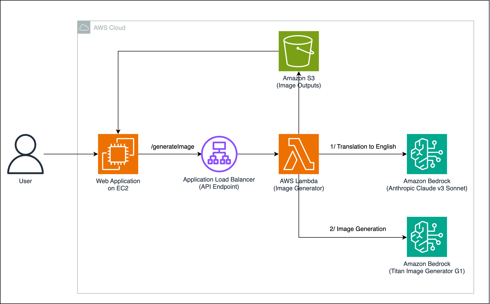

# TIG Ad Image Studio

이 데모는 전문적인 디자인 지식 없이 제품 이미지를 기반으로 한 맞춤형 광고 창작물을 쉽게 생성할 수 있게끔 돕는 이미지 생성 도구입니다.

Amazon Titan Image Generator(TIG)를 사용하여 실제 상품으로 맞춤 광고 이미지 만들는 작업을 할 수 있습니다.

이 프로젝트를 AWS 환경에 배포 후 실제 제품의 사진을 사용해 이미지를 광고 이미지를 생성할 수 있습니다.

## Architecture

이 데모는 Amazon Bedrock의 Anthropic Claude Sonnet v3와 Amazon Titan Image Generator (TIG)를 사용합니다.

1. Claude Sonnet v3는 다양한 User Input 기반으로 이미지 생성 프롬프트를 작성해 줍니다.
2. Amazon TIG는 생성된 프롬프트 기반으로 이미지 생성을 합니다.
