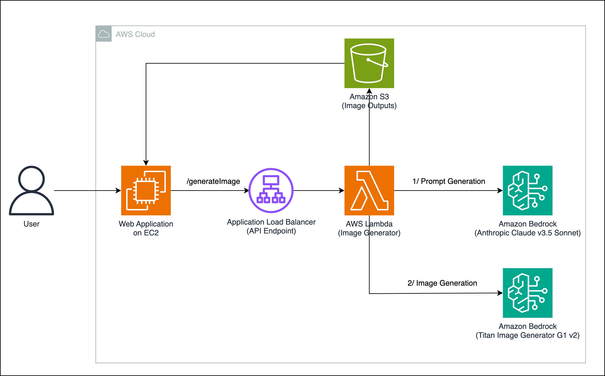

# TIG Ad Image Studio

> [!IMPORTANT]
> 이 데모는 Production을 위한 것이 아니며, 오직 시연 목적으로만 제작되었습니다.

이 데모는 전문적인 디자인 지식 없이 제품 이미지를 기반으로 한 맞춤형 광고 창작물을 쉽게 생성할 수 있는 이미지 생성 도구입니다.

Amazon Titan Image Generator(TIG) G1 v2를 사용하여 실제 상품으로 맞춤 광고 이미지를 만들 수 있습니다.

원하는 이미지에 대한 인풋을 받고 Claude v3.5 Sonnet 모델이 TIG의 프롬프트를 작성해 줍니다.

## Architecture



이 데모는 Amazon Bedrock의 Anthropic Claude Sonnet v3.5와 Amazon Titan Image Generator (TIG) G1 v2를 사용합니다.

1. Claude Sonnet v3.5는 다양한 User Input 기반으로 이미지 생성 프롬프트를 작성해 줍니다.
2. Amazon TIG는 생성된 프롬프트 기반으로 이미지 생성을 합니다.

## Demo Video

샘플 데모 영상은 [여기](https://d39see23shaae8.cloudfront.net/TIG_Ad_Studio_Demo_BHK.mp4)서 볼 수 있습니다.

## 사전 요구사항

1. [Docker 엔진](https://docs.docker.com/engine/install/)이 실행되고 있는지 확인합니다.

2. [Amazon Bedrock 콘솔 페이지](https://www.google.com/url?sa=t&source=web&rct=j&opi=89978449&url=https://us-west-2.console.aws.amazon.com/bedrock/home%3Fregion%3Dus-west-2&ved=2ahUKEwin54Oz1P6IAxXUafUHHcyQAR8QFnoECAcQAQ&usg=AOvVaw1F7VeXkbByZjaTYYLTR9N9)에서 미국 오레곤(us-west-2) 리전을 선택하고 아래 두 가지 모델의 [Model Access](https://docs.aws.amazon.com/bedrock/latest/userguide/model-access.html)를 요청합니다. 

> [!IMPORTANT]
> 꼭 미국 오레곤(us-west-2) 리전을 선택하세요

- Anthropic Claude Sonnet v3.5

- Amazon Titan Image Generator G1 v2

## Deploy the CDK Stack

CDK를 [여기](https://docs.aws.amazon.com/ko_kr/cdk/v2/guide/getting_started.html)에 설명된 대로 설정하고 아래 명령어를 사용하여 모든 Dependency를 설치합니다. 

```
git clone https://github.com/madebybk/tig-ad-image-studio.git
cd tig-ad-image-studio
npm install
```

AWS CDK 애플리케이션을 CloudFormation 코드로 컴파일합니다.
```
cdk synth
```

AWS 환경에 CDK Toolkit을 위한 스택을 배포합니다.
```
cdk bootstrap
```

AWS 계정에 스택을 배포합니다.
```
cdk deploy --all
```

## 웹 애플리케이션에 접속하기

배포가 완료되면 `TIGAdImageStudio-WebAppStack.webAppUrl`이라는 OutputOutput이 제공됩니다. 이 IP 주소를 브라우저 입력창에 입력하여 TIG Ad Studio에 접속합니다. (인스턴스 프로비저닝 시간이 필요하므로 바로 접속이 안 되면 3~4분 후에 다시 시도해 주시기 바랍니다.)

## TIG Ad Studio 사용

“이미지 생성 예시”와 “이미지 수정 예시”에 따라 이미지 생성을 해봅니다.
“이미지 생성”은 아웃페인팅(백그라운드 수정)을 하는 것이고, “이미지 수정”은 인페인팅(특정 부분을 수정)을 하는 것입니다.


## 리소스 정리

데모를 삭제하려면 먼저 Amazon S3 Bucket에서 생성된 Bucket을 비우고 CloudFormation에서 생성된 Stack을 Delete 합니다.

1. [Amazon S3](https://us-west-2.console.aws.amazon.com/s3/buckets?region=us-west-2) 페이지로 이동하여 **titan-ad-studio-bucket**으로 시작하는 Bucket을 찾습니다. **Empty** 버튼을 눌러 S3 Bucket에 있는 모든 파일을 삭재합니다.

2. [Amazon CloudFormation](https://us-west-2.console.aws.amazon.com/cloudformation/home?region=us-west-2#/getting-started) 페이지로 이동하여 `TIGAdImageStudio-WebAppStack`과 `TIGAdImageStudio-ImageGenerationStack`을 Delete 합니다.

## Troubleshooting

1. "400 Bad Request: Value of (width, height) is not valid. Given: (1280, 1294)."와 같은 에러 메시지는 인풋 이미지 크기 관련 에러입니다. [Amazon TIG 공식 문서](https://docs.aws.amazon.com/bedrock/latest/userguide/model-parameters-titan-image.html#w315aac17c27c15b9b7c21b5b7)따라 모델이 허용하는 이미지 크기로 다시 입력해 주세요.
